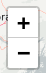
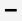
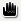
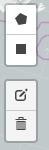
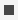
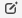
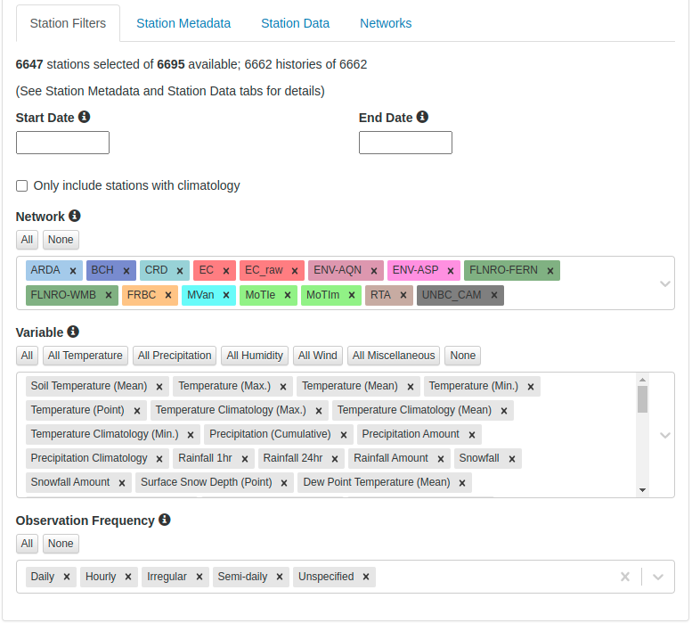
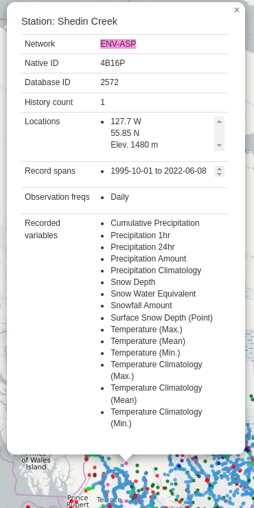
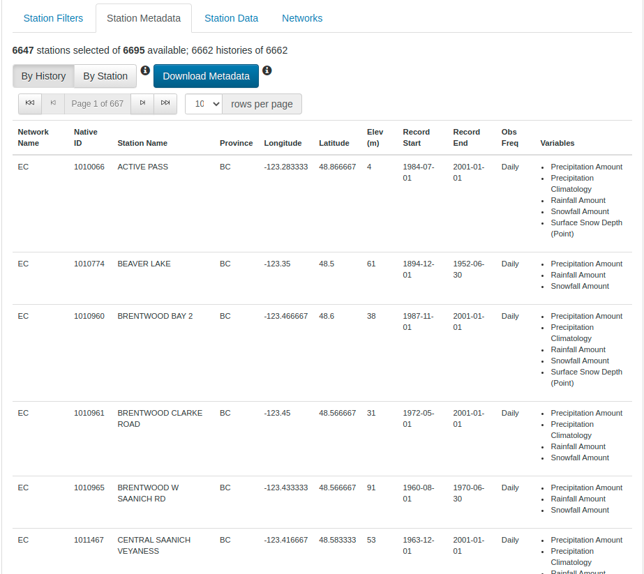
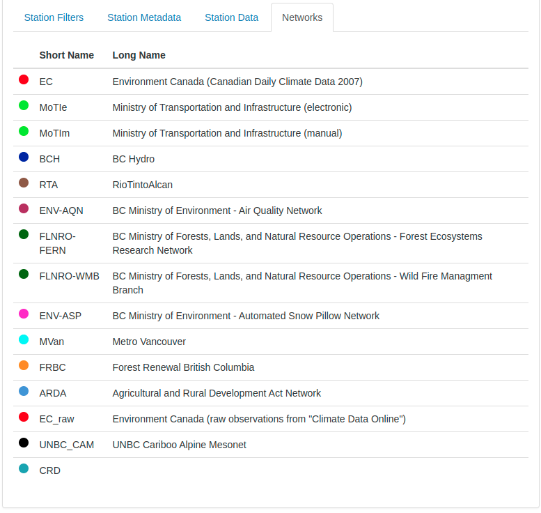

# Station Data Portal

Two databases maintained at PCIC contain observations of weather and climate
variables (such as temperature and rainfall amounts) for various regions
in Canada. At present there are two such regions, British Columbia
(the Provincial Climate Data Set, or PCDS) and
the Yukon and Northwest Territories.

The Station Data Portal (SDP) is an application that permits users to find
and download data from thes observational databases. A separate instance of 
the SDP serves data for each separate region. The SDP functions nearly 
identically for each region.

In the SDP, locations of observation stations are shown on an interactive 
map of the 
region, which enables a user to zoom and pan to a region of interest, 
learn about the stations that are there, filter the displayed stations 
based on observation date, weather element, observing agency, spatial location,
and more.

## Starting the Station Data Portal

To start the SDP, browse to the appropriate web page. The SDP app runs in your
browser.

For some regions, the app presents a disclaimer that must be accepted
before it can be used to access data. Click the **Accept** button to accept
the terms of use and enter the app proper.

The SDP's first action is to request all data describing stations in its
region database. This may take a few seconds. During this time, the map
will show only the background base map. When all the descriptive data
(metadata) has loaded, the map will show markers for each station.

## Stations and histories

Each station has one or more history items associated with it.

A history item describes a particular configuration of a station, including its name, location, and the variables it reports (which relate to the sensors installed in the station hardware). Many stations have only one history item, but some have several, reflecting changes of location or equipment.

The distinction between station and history is often glossed over, but it does appear in things like station markers (there is one marker per unique station location, which is derived from histories) and in the metadata available on the **Station Metadata** tab. See below for details.

## Finding and selecting stations

You find and select stations by using a combination of station filtering options and spatial selection tools on the map. 

The map is the primary display of the stations you have selected. It typically takes up much of the screen real estate, which it shares with a set of tabs that include station filtering. You can adjust the proportion of the screen allocated to the map and the tabs by using the column width controls at the top of the display.

The main display area is divided into two columns, whose width can be adjusted in increments of 1/12 of the window width.

- To move the division one increment left or right, click the `<` or `>` button.
- To move the division two increments left or right, click the `<<` or `>>` button.
- To move the division completely to the left or right, click the `!<` or `>!` button.

### Finding and selecting stations on the map

The map shows all stations which meet the selection criteria
in the **Station Filters** tab. A station is indicated by a circular marker at the station location. (More precisely, there is a marker for every unique station location recorded in its history records.) The colour of a station marker denotes the network it is part of. If a station has two or more unique locations, the markers for it are connected by coloured lines.

#### Navigating the map

You can:
- Zoom in: Click the zoom in  icon in the upper left, double-click on the map, or roll the mousewheel forward.
- Zoom out: Click the zoom out  icon in the upper left, or roll the mousewheel backward.
- Pan: Click and drag the mouse pointer  on the map.

Note that zooming in to a particular area does not exclude stations which are out of your field of view from the set of selected stations. To select a spatially-limited subset of stations, you can draw one or more polygons on the map. To do so you must use one of the polygon drawing tools in the map toolbar on the left-hand side.

#### Drawing polygons (spatial selection)

You can draw one or more polygons on the map. Any visible (filtered) station inside any polygon is selected.

 &nbsp; To draw a roughly rectangular polygon, click the **Draw a rectangle** tool icon.
  Click and drag the mouse pointer from one corner of your desired rectangular region to the opposite corner.

 &nbsp; To draw a more elaborate polygon, click the **Draw a polygon** tool icon.
  Click on the map at each successive corner of the polygon.
  Finish the polygon by clicking on the first corner again.

 &nbsp; To edit a polygon already drawn on the map, click the **Edit shapes** icon.
  Click and drag the corners of a polygon on the map to adjust its shape. A rectangle's location and dimensions can be changed but not the rectangular shape. A general polygon can be adjusted arbitrarily, including adding new corners by clicking "ghost" corners in the middle of existing edges.

 &nbsp; To remove one or more polygons from the map, click the **Remove shapes** icon. 
  To remove all shapes, click **Remove all**. To remove a single shape, click on it. Repeat as desired. When you have removed all shapes you wish to remove, click **Save**. To cancel the effect of removing one or more individual shapes, click **Cancel**. 

When you add, remove or change a polygon on the map, the station count on the **Station Filters** tab is adjusted to reflect the stations selected. However, _all_ stations selected by the station filters are still shown on the map so that you can adjust your polygon(s) to include or exclude particular stations.

### Filtering stations (**Station Filters** tab)

When the app starts up (i.e., the web page is refreshed), all available stations are loaded and shown on the map. To select stations by criteria including date range of available observations, the network they are part of, the variables they report, and the frequency of observations reported by the station, use the controls on **Station Filters** tab.

At the top of the **Station Filters** tab is a legend that shows the number of stations selected by these controls (and by the map polygons, see above) out of the total available. 

The following controls control the filtering of stations.

**Start Date**, **End Date**: Select only stations with observations within this period. Either date may be unspecified, in which case it means the earliest or latest date available, respectively. Default is empty (no filtering by date).

**Only include stations with climatology**: Some stations have climatology variables associated with them. (These variables are typically computed after the fact from instantaneous values reported by the station). To select only stations for which there are climatology variables, check the checkbox. Default is unchecked.

**Network**: Each station is part of a particular network. To select stations from particular networks, select one or more of them using the multi-select control. Default is all available stations.

**Variable**: Different stations report different variables. To select stations that report specific variable types, select one or more variable types using the multi-select control. Default is all available variables.

**Observation frequency**: Different stations report observations at different frequencies (intervals between reports). To select stations that report at specific frequencies, select frequencies using the multi-select control. Default is all available reporting frequencies.

When you change one of the station filtering controls, the station count on the tab and the markers on the map are updated to reflect the newly selected stations. The map update can take a few seconds, and all controls are frozen during the update. Please be patient.

## Getting information about stations

Each station has associated with it a collection of metadata that describes it: name, location, variables reported, etc.

### Metadata on the map

On the map, you can view the metadata for a single station by clicking on the station marker. A popup displaying the metadata appears. Here is an example:

To dismiss the popup, click the X in the upper right corner.

### Bulk metadata

Searching for stations using the map is a much easier way to find station than is wading through a long spreadsheet of station attributes. That said, there can be substantial value and many use cases for obtaining the list of station attributes. On the **Station Metadata** tab, you can view and download the station attributes in a way that is dynamic and responsive your changes to the station filters.

The tab contains a datagrid that presents the metadata for all stations selected jointly by the station filters and the map polygons. As the filters or map polygons are updated, the contents of the datagrid change accordingly.

Station metadata can be viewed and downloaded in two formats: by history and by station. (For information on the distinction between station and history, see the section above.) 

The by-history format presents one history per datagrid row, repeating
station information in each row as necessary. It is a less compact
and readable format, but more easily mechanically processed, and
it breaks out values such as latitude and longitude into separate
columns. That is why it is the default format.

The by-station format presents one station per datagrid row,
and rolls up information from all histories
for a station into a more compact and readable form. It is
however less easily mechanically processed, and combines related
values such as latitude and longitude into single columns.

To see the metadata displayed in either format, click the appropriate button at the top of the tab.

The datagrid is paginated, so that only a fixed number of available records are in view at one time. Use the controls at the top or bottom of the datagrid to page through it.

The data in the datagrid can be downloaded as a CSV file at any time. To do so, click the **Download Metadata** button. A Save As dialog comes up. Select the name and location of the file in which to save the CSV file, and click Save.

The data in the downloaded CSV file includes all columns shown in the datagrid, plus a few extra ones that are convenient for automated processing of the data.

## Downloading station data

The final step in using the data portal, downloading station data, is typically the easiest. Data download is provided on the **Station Data** tab.

This tab shows a count of the stations selected, and of the number of observations and climatologies available from those selected stations.

To download, select your desired output format, and then click either the **Download Climatology** button (if you want climatologies) or the **Download Timeseries** button (if you want the raw observations). The only additional option is a checkbox to optionally **Clip time series to filter date range**. If this is checked, your download will only include observations between the start date and end date that you have indicated in the station filtering options. If unchecked, you will get the full time range for all selected stations.

## Networks

The **Networks** tab lists details of all networks, showing their colour coding on the map. It serves as a legend to the map.

## Unexpected behaviour

There are a few nuances to the aggregated data download that work the way the user expects most of the time, but may be unexpected in a few ways.

1. Even if you zoom in the map and limit your field of view, there may be selected stations that extend beyond the field of view. Stations are selected based on your entire set of filters, and are completely unaffected by your view on the map.
2. When downloading data, all variables for a selected station are included in the download _regardless of whether you filter by variable_. This is slightly different behaviour than is exhibited by the time selection, so it’s a point that warrants attention.
3. When downloading timeseries data, if you have selected stations by drawing a polygon but have not filtered those stations by date range or meteorological variable, your selection may include stations with no data available. Files for these stations will still appear in your downloaded archive, but they will not contain any observations, only metadata and headings.

10